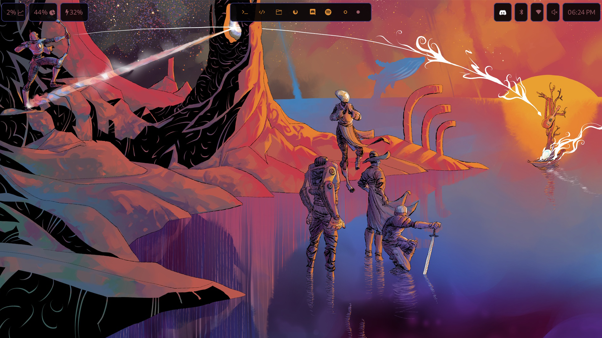

# dotfiles

dotfiles for the configurations of my laptop's linux install.

### Software

- **OS** - EndeavourOS
- **Window Manger** - Hyprland
- **Bar** - Waybar
- **Launcher** - Wofi
- **Colorscheme Generator** - Pywal
- **Shell** - Zsh with PowerLevel10k
- **IDEs** - Visual Studio Code & NeoVim with NVChad
- **File Manager** - Dolphin

